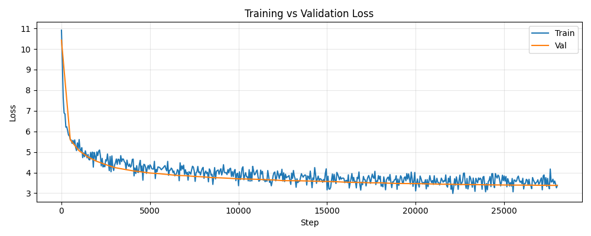

# GPT From Scratch

A decoder-only transformer language model implemented and trained from scratch in PyTorch. Created with no pretrained weights and external LLM libraries. Built to understand the full process of modern LLM training including architecture, tokenization, optimization, and the diagnostic process of getting a small model to actually generalize rather than memorize.

Base architecture and training script adapted from [raiyanyahya/how-to-train-your-gpt](https://github.com/raiyanyahya/how-to-train-your-gpt) -- See [Acknowledgments](#acknowledgments) below for what was original vs. adapted.

## Architecture

- Decoder-only transformer (GPT-style), causal self-attention
- **Rotary Position Embeddings (RoPE)** instead of learned/absolute position embeddings
- **RMSNorm** (pre-norm) instead of LayerNorm
- **SwiGLU** feed-forward blocks instead of standard MLP + ReLU/GELU
- Weight-tied input embedding / output projection (LM head)
- GPT-2 BPE tokenizer (via `tiktoken`), vocab size 50,257
- Mixed-precision training (`torch.amp`), gradient accumulation, gradient clipping
- Cosine learning rate schedule with linear warmup
- AdamW with decoupled weight decay (norm/bias params excluded from decay)

**A note on RoPE:** Implementing rotary position embeddings was the part of this project I found most interesting. It seemed strange at first, but upon further research, it turned out to be an incredibly clever mathematical trick. Instead of adding a separate positional vector to each token embedding, RoPE rotates the query and key vectors by an angle proportional to their position, in pairs of dimensions. This is such a clever technique because the dot product between two rotated vectors depends on the difference in rotation angle between them (which after RoPE, the positional distance is embedded in the difference of rotation) so tokens close together naturally produce a higher dot product, and tokens far apart naturally produce a lower one. However, related tokens that are far apart could still produce a higher dot product than closer ones if they are more relevant than an irrelevant close token. RoPE was able to achieve this without a separate learned or computed distance feature.

## Final training configuration

| Parameter | Value |
|---|---|
| `d_model` | 512 |
| `num_heads` | 8 |
| `num_layers` | 8 |
| `max_seq_len` | 256 |
| `batch_size` | 8 |
| `grad_accum_steps` | 4 |
| `max_steps` | 30,000 (reached step 28,000 before Colab's GPU usage limit ended the session) |
| `warmup_steps` | 300 |
| `learning_rate` | 3e-4 |
| **Total parameters** | **59,294,720** |
| **Final train loss** | **3.3858** (step 28,000) |
| **Final val loss** | **3.3797** (step 28,000) |

**Dataset:** [WikiText-103](https://huggingface.co/datasets/Salesforce/wikitext) (raw), full train split (~1.16M documents after filtering blank lines), held-out validation split (~2.5K documents) used for periodic evaluation.

**Hardware:** Single Tesla T4 (Google Colab), with checkpointing to Google Drive every 500 steps to survive session interruptions.

## The process

A raw loss number on its own doesn't say much and an interesting part of this project was diagnosing why exactly a low loss didn't mean a good model.

**First attempt; very low loss, but unusable output.**
An early run trained a 17M-parameter model on only 5,000 lines of WikiText for 50,000 steps. Training loss dropped to under 1.0, but generated text was fluent locally, but incoherent globally. It kept using the same handful of proper nouns regardless of prompt. With no validation loss being tracked, nothing explicitly said there was a problem. At first, I thought it may just be a limit of such little training data. Upon further inspection, I realized that the model had seen its ~285K token dataset more than 150 times. This signaled that the low loss was just a result of memorization, not learning. The model was incredibly overfitted.

**Adding a validation split.**
Held out a WikiText validation set and periodically evaluated the model on it during training to observe train/val divergence (a sign of overfitting).

**Scaling data and model size together.**
Re-ran with the fixes: more training data, a step count sized to a reasonable number of epochs over that data, and a larger model to actually make use of the extra data. Train and validation loss tracked closely throughout the run (no widening gap), showing generalization rather than memorization.

**Overnight run at increased scale.**
Final run: 8 layers / 512 dim (59.3M param) model on the full WikiText-103 train split, with checkpointing to Drive every 500 steps. Google Colab's GPU usage limit ended the session at step 28,200 out of a planned 30,000. I recovered it from the last Drive checkpoint (saved at step 28,000, train loss 3.39 / val loss 3.38). Since the validation loss had already leveled out quite a bit and training was ~93.3% complete, I decided to move forward with the model at 28,000 steps rather than restore the checkpoint and continue the last ~7% of training. In a professional environment, I would complete the training, but as this is a personal project, I prioritized saving some time over a small improvement in the validation loss.

## Loss curve

*Train and validation loss tracked together throughout training, with no widening gap. This supports that the model is generalizing rather than memorizing.*

## Sample generations

Prompt: `"The most important scientific discovery is"`
> The most important scientific discovery is the observation of the various organisms with different bioregia, the bioregia of species in the evolution of organisms, and a few species of organisms, from organisms that are in the same category.

Notably, **"bioregia" is not a real word and does not appear anywhere in the training data** (confirmed by direct search). It's a clean illustration of subword tokenization: GPT-2's BPE tokenizer encodes text as vocabulary pieces rather than whole words, and `bio` is a common standalone token in scientific text. At this model's current loss/perplexity, it's learned the statistical pattern that `bio` is often followed by certain kinds of technical suffixes — but hasn't fully learned the precise correct continuations, so at sampling time it occasionally combines real subword tokens into a plausible-looking non-word. It's a useful, concrete example of the gap between "the model has learned surface patterns" and "the model knows actual vocabulary."

Prompt: `"In the beginning the universe"`
> In the beginning the universe . " She gave the episode a " C " grade of 4 , stating , " It 's so much a bad episode – but not as a good episode . "
> <|endoftext|> = = = Critical reception = = =
> <|endoftext|> " The

This example is imperfect but shows something different, and arguably more encouraging, than the first: coherence *within and across* sentences, not just within a word. The quotation marks open and close correctly, the comparative clause ("not as a good episode") is grammatically sound, and the model sustains a consistent register throughout — this reads like a snippet of TV/media criticism, complete with a review-style grade and a `Critical reception` section header formatted exactly the way WikiText articles mark section breaks. That last part is notable: the model has learned that `<|endoftext|>` is often followed by a new Wikipedia-style header, and it reproduces that document structure correctly, not just plausible-looking words.

What it doesn't do is stay on topic — "the universe" is abandoned almost immediately in favor of an unrelated TV review, so the passage has local coherence (each clause is well-formed, the register is consistent) without global coherence (there's no throughline connecting it to the prompt, or to itself as a whole). Together with the "bioregia" example, this gives a fairly specific picture of the model's current ability: sentence-level and short-range structure is genuinely learned, while long-range topical grounding is not — which is consistent with a mid-single-digit loss on a ~59M-parameter model trained on a comparatively small token budget.

## What I'd do differently with more compute

- Scale to a GPT-2-small-equivalent config (768-dim, 12 layers, 12 heads) — commented out in the script but not run due to time/compute constraints
- Train on meaningfully more tokens relative to parameter count (roughly Chinchilla-optimal scaling suggests this run is still data-constrained relative to model size)
- Save full optimizer/scheduler state in checkpoints (not just model weights) to allow exact resumption after an interruption, rather than restarting the schedule from the nearest completed step
- Add downstream evaluation (e.g. simple perplexity benchmarks) beyond validation loss alone

## Repo contents

- `full_gpt.py` — complete training script (model, tokenizer wrapper, training loop, evaluation, generation)
- `loss_curve.png` — train/val loss curve from the final training run
- Model checkpoints available on request (not committed to the repo due to file size)

## Acknowledgments

The core architecture and training script are adapted from [raiyanyahya/how-to-train-your-gpt](https://github.com/raiyanyahya/how-to-train-your-gpt), which was the primary resource I learned from for this project. Credit to that repo for the model implementation (RoPE, RMSNorm, SwiGLU, the training/generation loop) and for teaching the underlying concepts.

What I added on top of that base:
- Diagnosed and fixed an overfitting issue in the original small-scale configuration (too little training data relative to step count)
- Added a validation split and periodic evaluation, which the base script didn't include, to make train/val divergence visible
- Scaled the data and model configuration for a larger training run
- Added Google Drive checkpointing to survive Colab session interruptions, and resumed training from a checkpoint after a mid-run disconnect
- Investigated and documented specific model behaviors (subword tokenization artifacts, sentence-level vs. topical coherence) shown in the Sample Generations section above
